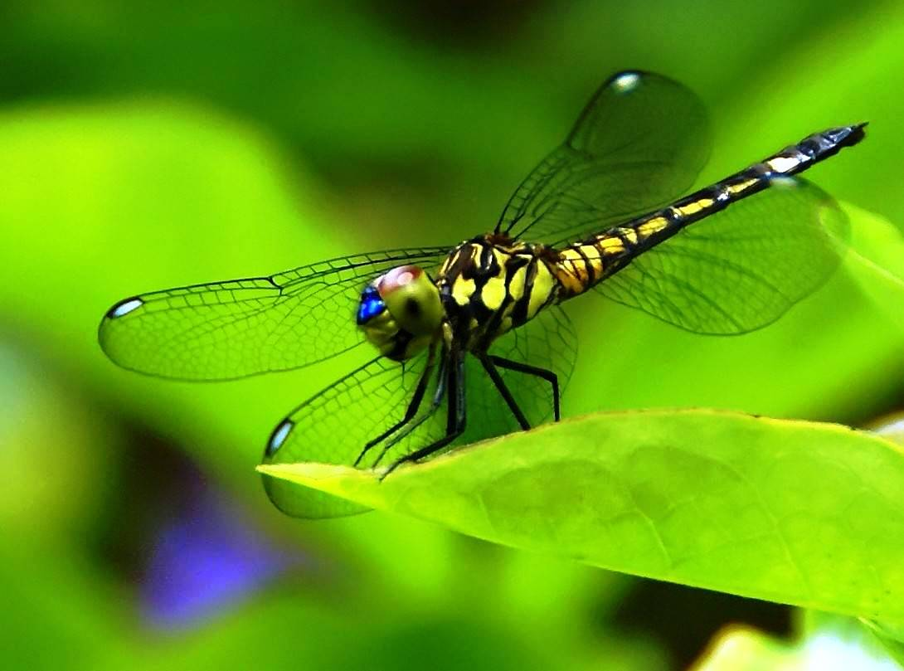

# Tugas Instrumentasi Visual

Project ini di dedikasikan untuk tugas matakuliah **Instrumentasi Sistem Visual**

## Instalasi visTF


Untuk instalasi dengan peritah **pip** pada terminal, yaitu:

```
python -m pip install http://bit.ly/visualDTNTF 
```

## Memulai

### membuat efek bulat-bulat

```python
from visTF import uts

image = uts.bulat('example/image/example.jpg')
image.make()
```

Berikut ini contoh hasilnya:

Sebelum:



Sesudah:


#### Setting Ukuran Lingkaran

```python
# image.setting(s,r)
image.setting(30,20)
```

```
.setting([s=20,[r=20]])

   s   = jarak antar titik arah horizontal
   r   = maksimum jari-jari lingkaran
```

